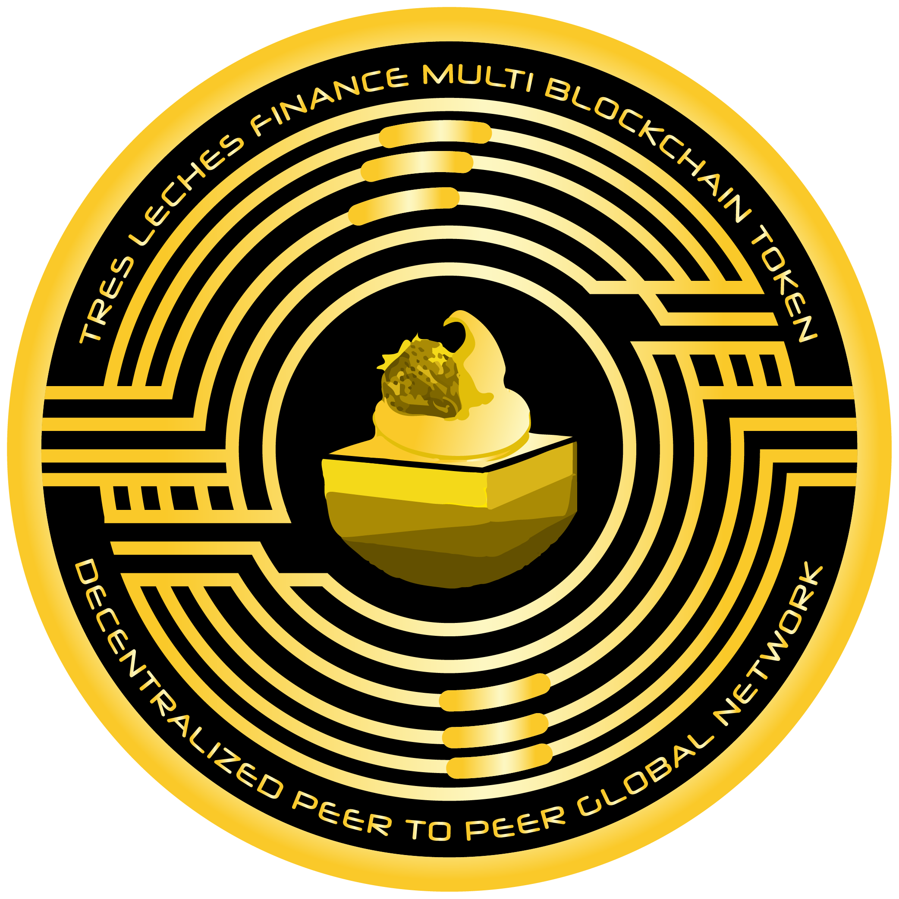

# Tres Leches

Tres Leches Token

Symbol: 3Leches

Decimal: 18

Max Supply: 25 Billion

<figure><figcaption>
Tres Leches Token Logo
</figcaption></figure>

| Blockchain          | Contract Number                                                                                                                 | Status     |
| ------------------- | ------------------------------------------------------------------------------------------------------------------------------- | ---------- |
| Binance Smart Chain | [0x27387362a24b27129da9fb8e4b68a170b72c9e74](https://bscscan.com/address/0x27387362a24b27129da9fb8e4b68a170b72c9e74)            | Active     |
| Polygon Mainnet     | [0x00525557A8cA7E01c633AE18925AE7Ae57Cb7d61](https://polygonscan.com/address/0x00525557A8cA7E01c633AE18925AE7Ae57Cb7d61)        | Active     |
| Phoenix             | [0x27387362A24B27129da9Fb8e4B68a170B72C9e74](https://phoenixplorer.com/address/0x27387362A24B27129da9Fb8e4B68a170B72C9e74)      | Active     |
| Dogechain           | [0x9bc11331Bf27D3ebAf784a83B2edC25094086728](https://explorer.dogechain.dog/address/0x9bc11331Bf27D3ebAf784a83B2edC25094086728) | Active     |
| Ethereum            | Pending                                                                                                                         | Not Active |

